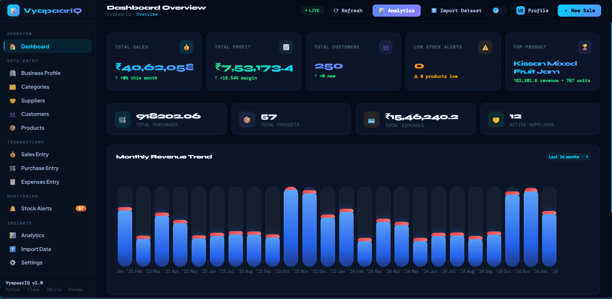
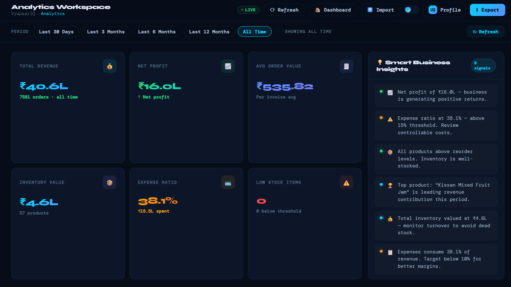
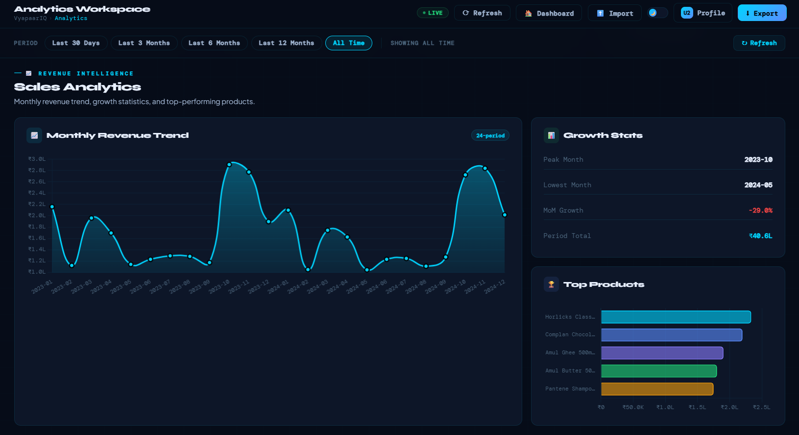
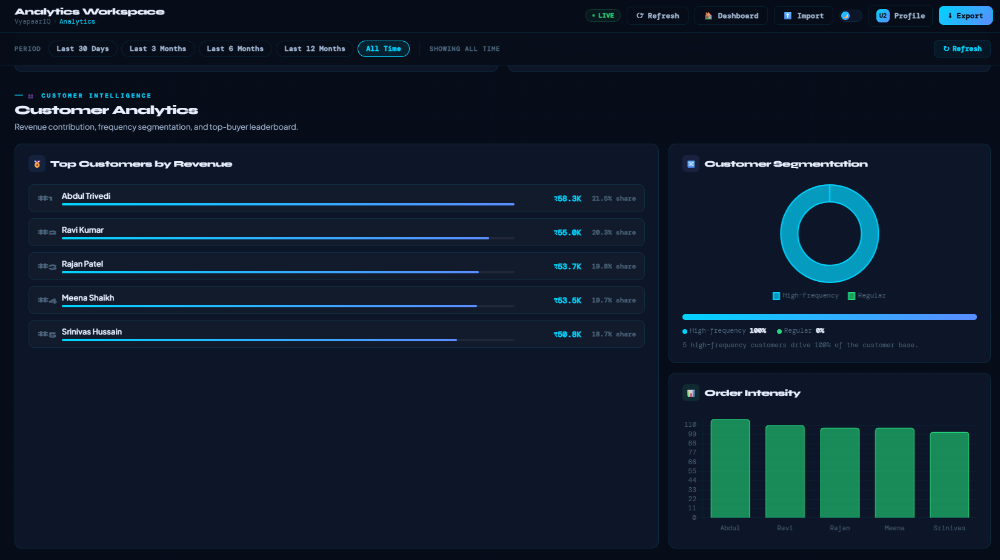
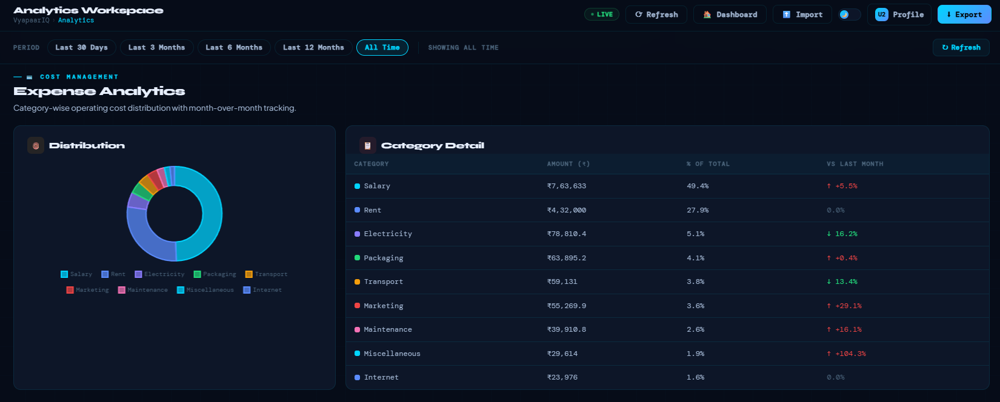
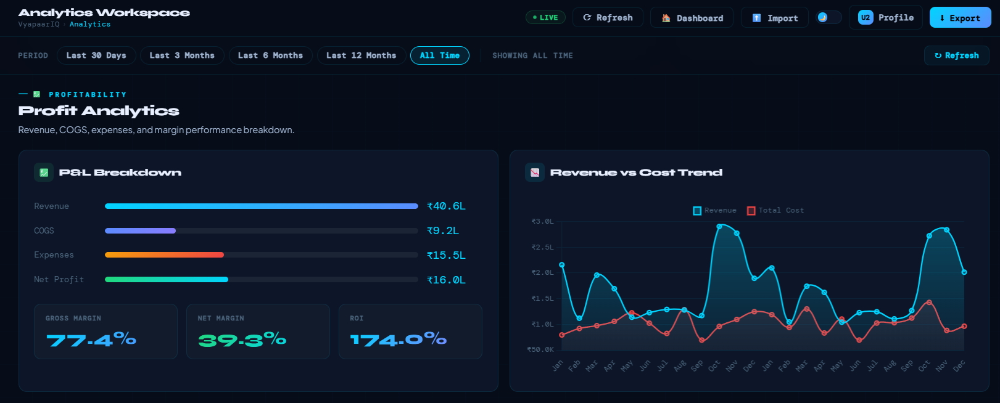
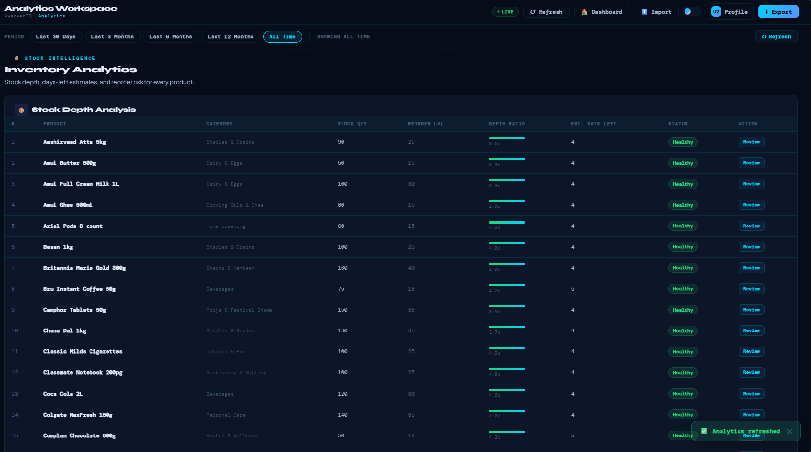

[](https://vyapaariq.onrender.com)

# VyapaarIQ — Business Analytics Dashboard

VyapaarIQ is a retail business analytics dashboard I built to simulate how small shop owners track sales, inventory, expenses and customer performance in real time.

Instead of visualizing static CSV files like most portfolio dashboards, this project works like a lightweight ERP-style analytics system where transactions update KPIs instantly.

It demonstrates how SQL analytics, backend services, and interactive dashboards connect to support real business decisions.

**Live Demo → https://vyapaariq.onrender.com**

New users can load **24 months of realistic retail demo data with one click**, allowing the full analytics workspace to be explored immediately without manual setup.

---

## What Makes This Project Different

Most dashboard portfolio projects stop at charts built from static datasets.

VyapaarIQ works differently:

- Multi-user architecture with fully isolated datasets per account
- Real transaction entry workflows — sales, purchases, expenses
- KPIs update automatically after every entry
- 24-month demo dataset generator so anyone can explore it instantly
- Production deployment running on PostgreSQL
- Responsive analytics workspace with dynamic date range filters

This reflects how analytics tools actually behave in real business environments — not just pretty charts on top of a CSV file.

---

## Screenshots

### Dashboard Overview



Real-time KPI dashboard with monthly revenue trend and inventory alerts.

---

### Analytics Workspace Summary



Interactive analytics workspace showing revenue, profit, inventory value and expense intelligence.

---

### Sales Intelligence



Revenue trend analysis and product-level performance tracking.

---

### Customer Intelligence



Customer segmentation and top-revenue contributor tracking.

---

### Expense Intelligence



Category-wise operating expense distribution with month-over-month comparison.

---

### Profit Analytics



Profitability breakdown including revenue vs cost trend, gross margin, net margin and ROI metrics.


---

### Inventory Intelligence



Stock depth analysis with reorder-level monitoring and product-level inventory insights.


## Features

### Dashboard

- Live KPI cards — Total Sales, Profit, Customers, Low Stock Alerts, Top Product
- 24-month Monthly Revenue Trend bar chart
- Quick stats — Purchases, Products, Expenses, Suppliers
- Real-time activity feed

### Data Entry

- Business profile setup with GST number
- Categories, Suppliers, Customers, Products management
- Sales entry with multi-item line items and discount support
- Purchase entry with supplier and stock tracking
- Expense recording by category

### Analytics

- Revenue vs Cost trend charts
- Profit analysis with gross margin, net margin and ROI
- Customer insights — top 5 customers by revenue
- Expense breakdown by category with month-on-month change tracking
- Top products by revenue and quantity sold
- Inventory value tracker
- Adjustable date range filters (30 / 90 / 180 / 365 days / all time)

### Inventory

- Stock alert configuration per product
- Low stock threshold monitoring
- Reorder level tracking

### Other

- OTP-based email signup verification
- Import data from CSV
- Export all your data as a ZIP of CSVs
- Light / Dark mode toggle
- Fully responsive — works on mobile and desktop
- Demo data mode — load 24 months of sample kirana store data in one click

---

## Analytics Engineering Highlights

This project includes a reusable analytics service layer that:

- Aggregates KPI metrics directly from transactional tables using SQL
- Supports rolling date-range filters (30 / 90 / 180 / 365 days)
- Works with both SQLite locally and PostgreSQL in production without code changes
- Normalizes imported datasets automatically on upload
- Handles chart lifecycle correctly to prevent duplicate rendering

The goal was to simulate a production-style analytics pipeline rather than building a template dashboard on top of a static file.

The query logic lives in a service layer separate from route handlers, which makes it easier to test and extend independently.

---

## Tech Stack

| Layer | Technology |
|------|------------|
| Backend | Python 3, Flask 3.1 |
| Database | PostgreSQL (production), SQLite (local dev) |
| Queries | Raw SQL via psycopg3 / sqlite3 |
| Frontend | Vanilla HTML, CSS, JavaScript |
| Charts | Chart.js |
| Auth | Session-based with OTP email verification |
| Email | Gmail SMTP via Python smtplib |
| Deployment | Render (Web Service + PostgreSQL) |
| WSGI Server | Gunicorn |

---

## System Architecture

VyapaarIQ follows a layered analytics workflow similar to production BI dashboards:

Frontend (Chart.js dashboards)
↓
Flask API layer
↓
Analytics service layer
↓
SQLite (local development) / PostgreSQL (production)

This structure keeps analytics logic reusable, testable, and database-independent.

---

## Data Model Overview

VyapaarIQ uses a normalized transactional schema including:

- categories
- suppliers
- customers
- products
- sales + sale_items
- purchases + purchase_items
- expenses
- stock_alerts
- business_profiles

These tables support real-time KPI aggregation through SQL analytics services.

---

## Project Structure

```

VyapaarIQ/
├── app.py
├── requirements.txt
├── .gitignore
│
├── database/
│   ├── init_database.py
│   ├── migration_production.py
│   ├── db_utils.py
│   └── demo_loader.py
│
├── routes/
│   └── import_routes.py
│
├── services/
│   ├── analytics_service.py
│   ├── import_executor.py
│   ├── normalization_service.py
│   └── validation_service.py
│
├── static/
│   ├── css/
│   │   ├── dashboard.css
│   │   └── analytics.css
│   └── js/
│       ├── dashboard.js
│       └── analytics.js
│
└── templates/
├── dashboard.html
├── analytics.html
├── index.html
├── login.html
├── signup.html
├── import.html
└── settings.html

```

---

## Getting Started

### Prerequisites

- Python 3.11+
- PostgreSQL (for production) or SQLite (works out of the box locally)
- Gmail account with App Password enabled (for OTP emails)

---

### Local Setup

Clone the repository

```

git clone [https://github.com/Kirito263V/VyapaarIQ.git](https://github.com/Kirito263V/VyapaarIQ.git)
cd VyapaarIQ

```

Create virtual environment

```

python -m venv venv
source venv/bin/activate
venv\Scripts\activate

```

Install dependencies

```

pip install -r requirements.txt

```

Create `.env` file

```

SECRET_KEY=your-secret-key-here
SMTP_EMAIL=[youremail@gmail.com](mailto:youremail@gmail.com)
SMTP_APP_PASSWORD=your-gmail-app-password

```

Run the app

```

python app.py

```

Visit

```

[http://localhost:5000](http://localhost:5000)

```

Database schema initializes automatically.

---

## Deploying to Render

1. Create PostgreSQL database on Render

2. Create Web Service

Build Command:

```

pip install -r requirements.txt

```

Start Command:

```

gunicorn app:app

```

Add environment variables:

```

SECRET_KEY
DATABASE_URL
SMTP_EMAIL
SMTP_APP_PASSWORD

```

Deploy — schema migrations run automatically on startup.

---

## Environment Variables Reference

| Variable | Required | Description |
|----------|----------|-------------|
| SECRET_KEY | Yes | Flask session secret |
| DATABASE_URL | Yes (prod) | PostgreSQL connection URL |
| SMTP_EMAIL | Yes | Gmail sender |
| SMTP_APP_PASSWORD | Yes | Gmail App Password |

---

## API Endpoints

(unchanged — your original table remains exactly correct)

---

## Why I Built VyapaarIQ

Most small businesses in India — kirana stores, distributors, local retailers — still track everything in notebooks or spreadsheets.

There is a gap between recording transactions and actually understanding business performance.

I wanted to design a lightweight analytics system where entering a sale immediately updates KPIs and insights across the dashboard.

VyapaarIQ represents that workflow end-to-end:

transaction entry → SQL aggregation → KPI services → interactive dashboards

Building this project helped me understand how analytics pipelines operate beyond static notebook-style reporting.

---

## Contributing

Pull requests welcome.

---

## Author

**Binaya**

I build analytics dashboards that simulate real business intelligence workflows using SQL, Python and interactive visualization layers.

This project is part of my analytics portfolio focused on practical KPI systems and end-to-end data pipelines rather than static reporting notebooks.

GitHub:

https://github.com/Kirito263V

LinkedIn:

www.linkedin.com/in/binaya-kumar-da

---

## License

MIT License

---

VyapaarIQ is designed with Indian small businesses in mind. Currency displays in Indian Rupees (₹) with Indian number formatting — lakhs and crores.
